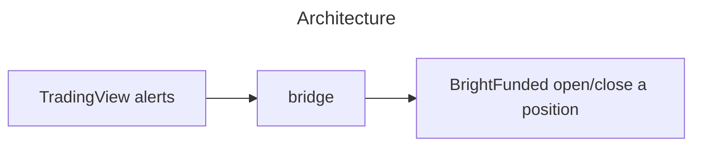

# prop-firm-puzzle
This bridge fills the gap between TradingView and BrightFunded to achieve algorithmic trading.

### Overview


### Setup Chrome
```sh
# Download the Google Chrome .deb package
wget https://dl.google.com/linux/direct/google-chrome-stable_current_amd64.deb

# Install the downloaded package
sudo dpkg -i google-chrome-stable_current_amd64.deb

# Fix any dependency issues
sudo apt-get install -f

# Launch Google Chrome
google-chrome
```

### Setup Firewall
```sh
# Check the status of UFW
sudo ufw status

# Allow traffic on port 80
sudo ufw allow 80/tcp

# Check the status again
sudo ufw status
```

### Setup Server
```sh
# Install dependencies
python -m venv venv
venv/bin/pip install -r requirements.txt

# Copy and modify settings
cp .env.example .env
```

```sh
# Run the server
venv/bin/fastapi run --port=80
```

### Setup Tradingview Alert
1. `Webhook URL` on Notifications tab
```
<YOUR_SERVER_WEBHOOK_HERE>
```
2. `Message` on Settings tab
```json
{"action":"{{strategy.order.action}}","contracts":"0.01","marketPosition":"{{strategy.market_position}}","positionSize":"{{strategy.position_size}}","prevMarketPosition":"{{strategy.prev_market_position}}","price":"{{close}}","symbol":"{{ticker}}","time":"{{timenow}}"}
```