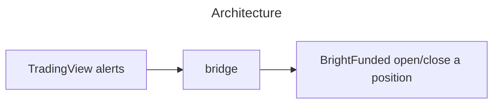

# prop-firm-puzzle
This bridge fills the gap between TradingView and BrightFunded to achieve algorithmic trading.

### Overview


### Setup

```sh
# Install dependencies
python -m venv venv
venv/bin/pip install -r requirements.txt

# Copy and modify settings
cp .env.example .env
```

```sh
venv/bin/fastapi run
```
